# Daily Reflection Tree — Visual Diagram

```mermaid
flowchart TD
    START([START\nGood evening...]) --> A1_OPEN

    A1_OPEN[A1_OPEN\nIf today were a road...] --> A1_D1{A1_D1\nDecision}

    A1_D1 -->|Smooth / Winding| A1_Q_AGENCY_HIGH[A1_Q_AGENCY_HIGH\nWhat made it go well?]
    A1_D1 -->|Bumpy / Blocked| A1_Q_AGENCY_LOW[A1_Q_AGENCY_LOW\nWhat was your first instinct?]

    A1_Q_AGENCY_HIGH --> A1_D2_HIGH{A1_D2_HIGH\nDecision}
    A1_Q_AGENCY_LOW --> A1_D2_LOW{A1_D2_LOW\nDecision}

    A1_D2_HIGH -->|Prepared/Focused/Adapted| A1_Q_CHOICE_HIGH[A1_Q_CHOICE_HIGH\nA decision moment today?]
    A1_D2_HIGH -->|Timing / Circumstance| A1_Q_CHOICE_MIXED[A1_Q_CHOICE_MIXED\nWhere were you sitting honestly?]

    A1_D2_LOW -->|Could still control| A1_Q_CHOICE_MIXED
    A1_D2_LOW -->|Waited / Pushed / Disengaged| A1_Q_CHOICE_LOW[A1_Q_CHOICE_LOW\nAnything still within influence?]

    A1_Q_CHOICE_HIGH --> A1_R_INT[/A1_R_INT\nReflection: You kept hands on the wheel/]
    A1_Q_CHOICE_MIXED --> A1_R_MIXED[/A1_R_MIXED\nReflection: Partly steered, partly carried/]
    A1_Q_CHOICE_LOW --> A1_R_EXT[/A1_R_EXT\nReflection: One small door.../]

    A1_R_INT --> BRIDGE_1_2
    A1_R_MIXED --> BRIDGE_1_2
    A1_R_EXT --> BRIDGE_1_2

    BRIDGE_1_2([BRIDGE\nNow: what did you put into today?]) --> A2_OPEN

    A2_OPEN[A2_OPEN\nOne interaction today — giving or receiving?] --> A2_D1{A2_D1\nDecision}

    A2_D1 -->|Giving / Contributing| A2_Q_CONTRIB_HIGH[A2_Q_CONTRIB_HIGH\nWhat did you actually do?]
    A2_D1 -->|Recognition / Fairness| A2_Q_ENTITLE[A2_Q_ENTITLE\nWhat drove that focus?]
    A2_D1 -->|Task list focus| A2_Q_NEUTRAL[A2_Q_NEUTRAL\nDid anyone need something today?]

    A2_Q_NEUTRAL --> A2_D2_NEUTRAL{A2_D2_NEUTRAL\nDecision}
    A2_D2_NEUTRAL -->|Noticed and helped| A2_Q_EXPECTATION
    A2_D2_NEUTRAL -->|Didn't help / Didn't notice| A2_R_NEUTRAL[/A2_R_NEUTRAL\nReflection: Heads-down — by choice or by safety?/]

    A2_Q_CONTRIB_HIGH --> A2_Q_EXPECTATION[A2_Q_EXPECTATION\nWhat were you expecting back?]
    A2_Q_EXPECTATION --> A2_R_CONTRIB[/A2_R_CONTRIB\nReflection: You made a deposit today/]

    A2_Q_ENTITLE --> A2_R_ENTITLE[/A2_R_ENTITLE\nReflection: What did you stop giving?/]

    A2_R_CONTRIB --> BRIDGE_2_3
    A2_R_ENTITLE --> BRIDGE_2_3
    A2_R_NEUTRAL --> BRIDGE_2_3

    BRIDGE_2_3([BRIDGE\nLast stretch — zoom out from you]) --> A3_OPEN

    A3_OPEN[A3_OPEN\nWho is in the frame of today's challenge?] --> A3_D1{A3_D1\nDecision}

    A3_D1 -->|Just me| A3_Q_SELF[A3_Q_SELF\nWho else is affected tomorrow?]
    A3_D1 -->|Me and a colleague| A3_Q_DYAD[A3_Q_DYAD\nHow did today feel for them?]
    A3_D1 -->|Whole team / Customer| A3_Q_WIDE[A3_Q_WIDE\nWhat did you feel toward them?]

    A3_Q_SELF --> A3_R_SELF[/A3_R_SELF\nReflection: Quick scan next time/]
    A3_Q_DYAD --> A3_R_DYAD[/A3_R_DYAD\nReflection: Zooming out is not nothing/]
    A3_Q_WIDE --> A3_R_WIDE[/A3_R_WIDE\nReflection: Highest-effort thing on this list/]

    A3_R_SELF --> SUMMARY
    A3_R_DYAD --> SUMMARY
    A3_R_WIDE --> SUMMARY

    SUMMARY[SUMMARY\nAxis synthesis with interpolated answers] --> END([END\nSee you tomorrow.])

    style START fill:#4a90d9,color:#fff
    style END fill:#4a90d9,color:#fff
    style BRIDGE_1_2 fill:#f0a500,color:#fff
    style BRIDGE_2_3 fill:#f0a500,color:#fff
    style SUMMARY fill:#27ae60,color:#fff
    style A1_D1 fill:#e74c3c,color:#fff
    style A1_D2_HIGH fill:#e74c3c,color:#fff
    style A1_D2_LOW fill:#e74c3c,color:#fff
    style A2_D1 fill:#e74c3c,color:#fff
    style A2_D2_NEUTRAL fill:#e74c3c,color:#fff
    style A3_D1 fill:#e74c3c,color:#fff
    style A1_R_INT fill:#8e44ad,color:#fff
    style A1_R_MIXED fill:#8e44ad,color:#fff
    style A1_R_EXT fill:#8e44ad,color:#fff
    style A2_R_CONTRIB fill:#8e44ad,color:#fff
    style A2_R_ENTITLE fill:#8e44ad,color:#fff
    style A2_R_NEUTRAL fill:#8e44ad,color:#fff
    style A3_R_SELF fill:#8e44ad,color:#fff
    style A3_R_DYAD fill:#8e44ad,color:#fff
    style A3_R_WIDE fill:#8e44ad,color:#fff
```

## Node Type Legend

| Color | Type | Role |
|-------|------|------|
| 🔵 Blue | Start / End | Session boundaries |
| 🟡 Orange | Bridge | Axis transitions |
| 🟢 Green | Summary | Final synthesis |
| 🔴 Red | Decision | Internal routing, invisible to user |
| 🟣 Purple | Reflection | Insight/reframe shown to user |
| White | Question | User picks from fixed options |

## Tree Statistics

| Metric | Count | Requirement |
|--------|-------|-------------|
| Total nodes | 36 | 25+ ✅ |
| Question nodes | 12 | 8+ ✅ |
| Decision nodes | 6 | 4+ ✅ |
| Reflection nodes | 9 | 4+ ✅ |
| Bridge nodes | 2 | 2+ ✅ |
| Axes covered | 3 | All 3 ✅ |
| Summary node | 1 | 1+ ✅ |

## Possible Conversation Paths

The tree supports **9 distinct paths** through the three axes:

- **Axis 1** branches: High agency → High choice, High agency → Mixed, Low agency → Mixed, Low agency → Low choice = **4 entry paths**
- **Axis 2** branches: Contribution, Entitlement, Neutral-helped, Neutral-ignored = **4 branches**
- **Axis 3** branches: Self, Dyad, Wide = **3 branches**

Maximum unique complete conversations: **~36 distinct paths** depending on answer combinations within each branch.
